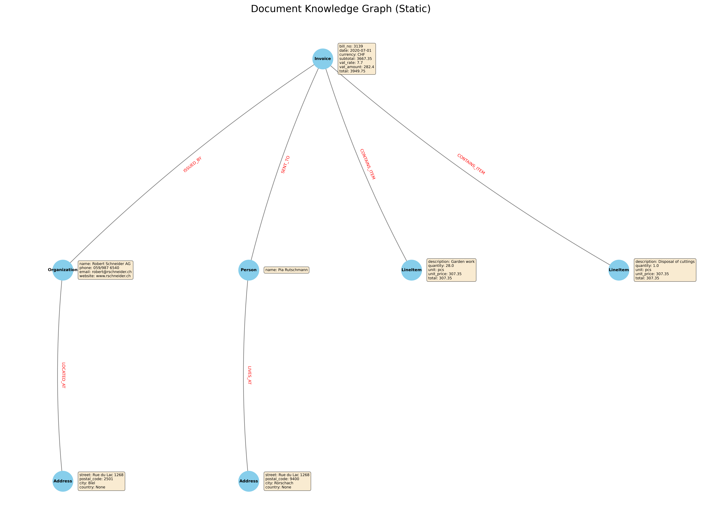

# Docling-Graph: Document to Knowledge Graph Converter

Turn any document into a structured, queryable knowledge graph using the power of Docling VLM pipeline.

**Docling-Graph** is a Python toolkit that leverages the schema-driven extraction capabilities of the `docling` library to transform unstructured documents (like invoices, reports, or articles) into a rich, interconnected knowledge graph. It automatically handles entity resolution, relationship linking, and provides powerful visualization tools.


## Core Features

### Schema-Driven Extraction
Define your desired entities and relationships using simple Pydantic models. Docling-Graph uses this schema to guide the foundation model, ensuring a clean, predictable, and structured output.

### Automatic Entity Deduplication
Intelligently identifies unique real-world entities. For example, "Robert Schneider AG" mentioned across ten documents will be treated as a single, canonical node, preventing data redundancy.

### Backend-Agnostic Export
The primary output is a universal JSON format (nodes and edges), allowing you to easily load your graph into any database like **Neo4j**, **Amazon Neptune**, or **TigerGraph**.

### Rich, Interactive Visualizations
Automatically generate beautiful, interactive graphs with **Plotly** for data exploration, or create static, publication-quality images.


## How It Works

The workflow is simple and powerful, designed to get you from a raw document to an insightful graph in minutes.

### 1. Define Your Schema

You define the "shape" of your desired knowledge graph using Pydantic models. Special `Edge` markers define the relationships between entities.

```python
class Organization(BaseModel):
    name: str = Field(description="The legal name of the organization")
    # ... other properties

class Invoice(BaseModel):
    bill_no: str = Field(description="The unique invoice identifier")
    # ... other properties
    
    # Define an edge from Invoice to Organization
    issued_by: Organization = Edge(label="ISSUED_BY")
```

See an example schema in `templates/invoice.py`.

### 2. Extract Structured Data (`extraction_invoice.ipynb`)
The `docling` library reads your document (e.g., a PDF or image) and uses your Pydantic schema to extract a structured data object.

### 3. Convert to a Graph (`graph_converter.py`)
The `GraphConverter` processes the extracted data, creating nodes for each entity and linking them with the defined edges. Its content-based hashing ensures entities are automatically deduplicated.

### 4. Visualize and Explore (`graph_visualizer.py`)
Instantly generate visualizations to understand the extracted knowledge.


## Project Structure

```
├── data/                       # Contains input example files (e.g., sample invoices)
├── outputs/                    # Default directory for generated graphs
├── templates/
│   └── invoice.py              # Pydantic schema for invoices
├── scripts/
│   └── graph_converter.py          # Core logic for converting Pydantic objects to a graph
│   └── graph_visualizer.py         # Functions for creating static and interactive visualizations
├── extraction_invoice.ipynb    # Main notebook demonstrating the full workflow
├── requirements.txt            # All project dependencies
└── README.md                   # This file
```


## Getting Started

### Prerequisites
- Python 3.8+
- Graphviz (optional, but required for hierarchical layouts in visualizations)

### Installation

Clone the repository:

```bash
git clone https://github.com/ayoub-ibm/docling-graph.git
cd docling-graph
```

Install dependencies:

```bash
pip install -r requirements.txt
```


## Usage

The easiest way to get started is to run the `extraction_invoice.ipynb` notebook.  
It contains a complete, step-by-step walkthrough of the entire process:

1. Loading the Pydantic schema from the templates directory.  
2. Using `docling` to extract data from a sample invoice.  
3. Using the `GraphConverter` to build the knowledge graph.  
4. Calling the `GraphVisualizer` to generate and display both static and interactive outputs.


## Examples

Below is an example output showing the conversion of a sample invoice into a knowledge graph.

### Sample Invoice


### Generated Knowledge Graph



## Future Work

Docling-Graph is currently in its initial boilerplate stage.. Future enhancements could include:

- Direct integration with graph databases (e.g., a `to_neo4j()` method).  
- More sophisticated entity resolution strategies.  
- Support for time-series and event-based graph analysis.
